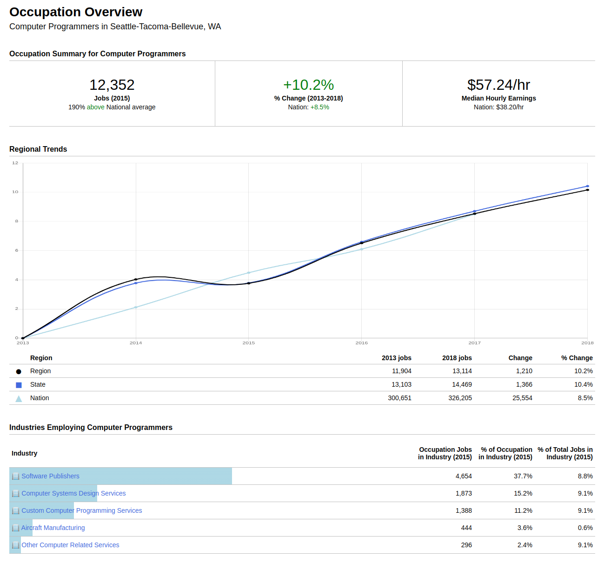

# Interview Project

## Deliverables
### Link to the GitHub repo
https://github.com/michaelsinghurse/emsi_react

### Screenshots of the final project

#### Chrome

### Instruction for running the code and viewing the web page
1. Download the project files.
2. Make sure you have Node and npm on your machine.
3. Run `npm install` at the command line.
4. Run `npm start` at the command line.
5. The app will be available at localhost port 3000.

